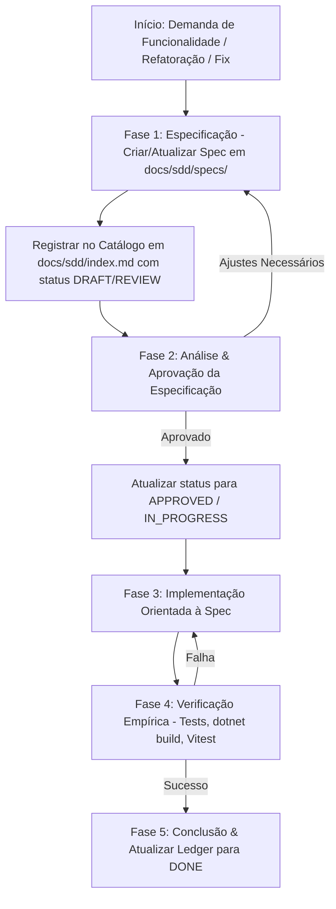

# Guia de Processo Operacional SDD (Workflow & Rules)

Este guia estabelece o fluxo de trabalho passo-a-passo obrigatório para todos os desenvolvedores humanos e Agentes de IA trabalhando no repositório **ScheduleNow**.

---

## Fluxo Geral do Ciclo de Desenvolvimento Guiado por SDD



---

## Fase 1: Elaboração da Especificação (`Spec Creation`)

1. **Escolha o Template Adequado:**
   - Para novas funcionalidades: [feature-spec-template.md](file:///c:/projetos/ScheduleNow/docs/sdd/templates/feature-spec-template.md)
   - Para arquitetura/ADR: [architecture-spec-template.md](file:///c:/projetos/ScheduleNow/docs/sdd/templates/architecture-spec-template.md)
   - Para correção de bugs: [bugfix-spec-template.md](file:///c:/projetos/ScheduleNow/docs/sdd/templates/bugfix-spec-template.md)
2. **Crie o Arquivo:**
   - Salve em `docs/sdd/specs/SPEC-XXX-nome-da-spec.md`.
3. **Preencha o Conteúdo Completo:**
   - Defina regras de negócio no Domínio, DTOs na Aplicação, Endpoints na API, Componentes Standalone no Angular e Estratégia de Testes.
4. **Atualize o Ledger (`docs/sdd/index.md`):**
   - Adicione uma nova linha na tabela de especificações com o status `[DRAFT]`.

---

## Fase 2: Análise e Aprovação (`Spec Approval`)

1. Valide se a especificação respeita integralmente os princípios imutáveis da [constitution.md](file:///c:/projetos/ScheduleNow/constitution.md):
   - Domínio `Scheduling.Domain` sem dependências externas.
   - FluentValidation para validação de entrada na camada Application.
   - Respostas de erro padronizadas em RFC 7807 Problem Details.
   - Angular 21 Standalone Components e tipagem TypeScript estrita sem `any`.
2. Após alinhamento, altere o status da especificação no catálogo [index.md](file:///c:/projetos/ScheduleNow/docs/sdd/index.md) para `[APPROVED]` ou `[IN_PROGRESS]`.

---

## Fase 3: Desenvolvimento Guiado pela Especificação (`Spec-Driven Coding`)

1. **Inspecione o Código Existente:** Nunca adivinhe assinaturas ou caminhos. Inspecione a fonte autoritativa antes de editar.
2. **Desenvolva por Camadas:**
   - **Camada 1: Domain (`Scheduling.Domain`)** - Entidades, Value Objects e Regras de Negócio.
   - **Camada 2: Application (`Scheduling.Application`)** - Interfaces, DTOs, Validadores FluentValidation e Casos de Uso.
   - **Camada 3: Infrastructure (`Scheduling.Infrastructure`)** - EF Core Mappings, Repositórios.
   - **Camada 4: API (`Scheduling.Api`)** - Controllers / Endpoints, Injeção de Dependências.
   - **Camada 5: Frontend (`Frontend/src/app`)** - Serviços HTTP, Models TypeScript e Componentes Angular Standalone.
3. **Mantenha a Rastreabilidade:** Mantenha a seção "Rastreabilidade de Código" da Spec atualizada com a lista de arquivos criados/modificados.

---

## Fase 4: Verificação Empírica Obrigatória (`Empirical Verification`)

Nenhuma especificação é considerada concluída sem verificação empírica no terminal:

### Comandos de Verificação:

1. **Backend (.NET 9):**
   ```powershell
   dotnet build .\Backend\Scheduling.Api\
   dotnet test .\Backend\
   ```

2. **Frontend (Angular 21 / Vitest):**
   ```powershell
   npm --prefix Frontend run build (ou ng build)
   npm --prefix Frontend test
   ```

> **Proibição Imutável:** NUNCA declare conclusão sem ter executado os testes e o build com sucesso total (código de saída 0).

---

## Fase 5: Conclusão e Registro (`Ledger Finalization`)

1. Atualize a seção da Spec com a matriz de testes executados e resultados obtidos.
2. No catálogo [index.md](file:///c:/projetos/ScheduleNow/docs/sdd/index.md), atualize o status da especificação para `[DONE]`.
